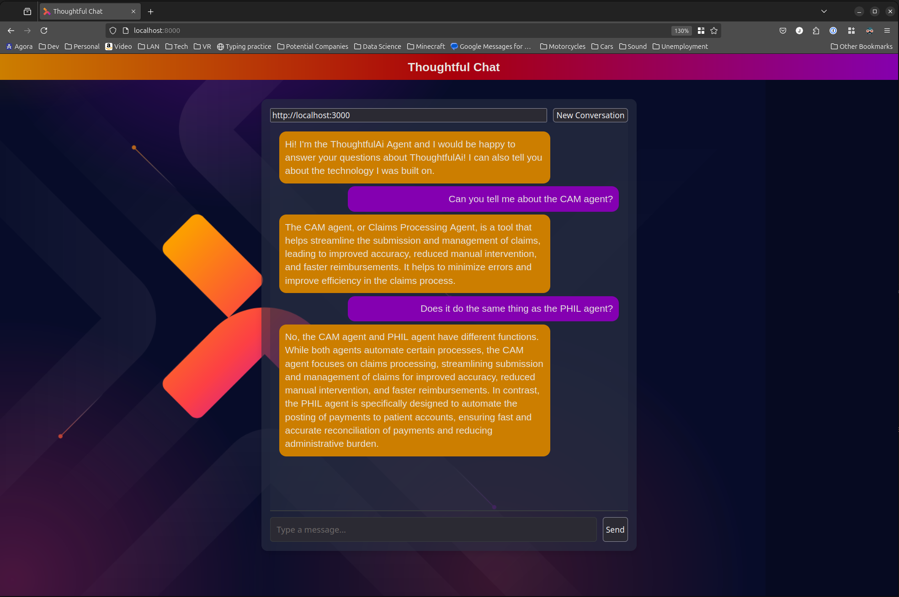
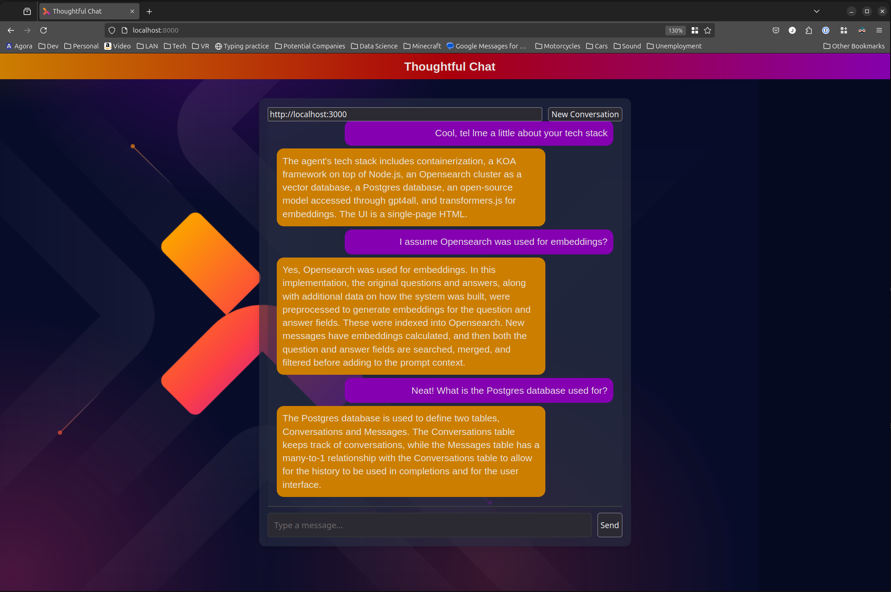

# Thoughful Agent
This implements a customer support AI Agent to assist users with basic questions about Thoughtful AI. The agent will use predefined, hardcoded responses to answer [common questions](https://github.com/joshuapage77/ThougghtfulAgent/blob/master/api/migrations/opensearch/data/thoughtfulqa.json) about Thoughtful AI as well as information about it's own tech stack.

## Implementation Overview
* The [docker](https://github.com/joshuapage77/ThougghtfulAgent/tree/master/docker) folder has a docker-compose.yml which defines an opensearch cluster and postgres DB

### Structure
* api - Node project using KOA framework to implement the backend
* web - Simple html front end served by http-server library
* docker - contains docker-compose.yml which creates containers for Opensearch cluser, Postgres, Flyway, and Opensearch-init

### API - KOA / Node.js
* The api is built using KOA
* Using gpt4all for completions. I didn't what there to be a requirement to have an OpenAI key in order to test this
   * This restricted me from using streaming results (only supported in python and I was already down the road of using node)
* Using transformers.js to generate embeddings (same reason as above)
* More information in that [project's README.md](https://github.com/joshuapage77/ThougghtfulAgent/tree/master/api)

### Lookup
* The sample data will be preprocessed and indexed in opensearch
   * Embeddings will be retrieved for the question and answer
* When determining a response, both the question and answer embeddings will be searched
   * a defined threshold will control whether an answer is found
* If an answer is found, it is returned
* If no answer is found, the llm will "do it's best"

### Flow
* POST /thoughtful/init - Starts a new conversation
* GET  /thoughtful/chat/:convId - list the conversation history
* POST /thoughtful/chat/:convId - send a new message

## Running Locally
### Prerequisites
* install docker CLI with the docker compose plugin
* install npm
* install node v23.6.0
   * I think at least v23.0.0 is needed becuase it enables requiring esm by default, but you could probably configure that too 
* From the project root execute: `$ npm run setup`
   * executes `npm install` in each project
   * builds the `Dockerfile` used for the `opensearch-qa-init container`

### Starting everything
All three components will need to be started to run the application. They can be started from the root of the project in three separate terminals (or command prompts for windows users)
* Start Docker: `$ npm run docker`
* Start API:    `$ npm run api`
* Start Web:    `$ npm run web`
* Launch Chat:  `$ npm run launch`
   * or just browse to: http://localhost:8000
* Launch Opensearch Dashboard: `$ npm run dashboard`
   * or just browse to: http://localhost:5601

## Chat Examples

